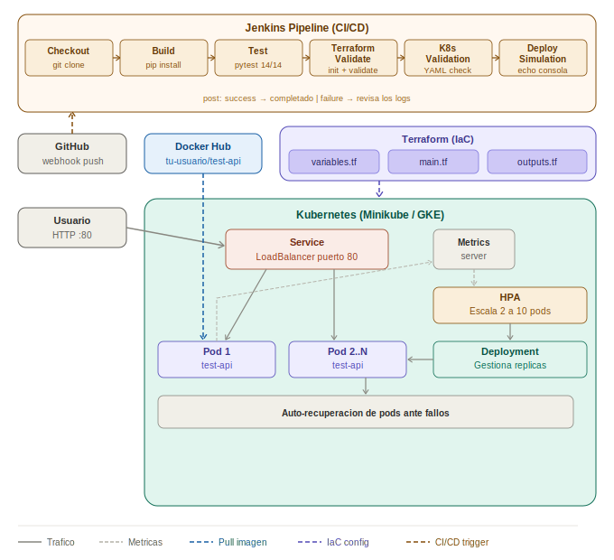

# proyecto-jenkins — Despliegue Escalable con Kubernetes

API REST en Python (FastAPI) desplegada en Kubernetes con escalabilidad automática (HPA) e infraestructura como código (Terraform).

**Integrantes:** Jefferson Ríos · Brayan Díaz

---

## Arquitectura



---

## Tecnologías

| Herramienta | Rol |
|---|---|
| FastAPI + Python 3.11 | API REST |
| Docker | Contenedorización |
| Docker Hub | Registro de imágenes |
| Kubernetes (Minikube) | Orquestación local |
| Terraform | Infraestructura como código (GKE) |
| Google Kubernetes Engine | Orquestación en la nube |

---

## Estructura del repositorio

```
proyecto-jenkins/
├── app/
│   └── app.py                 # API FastAPI
├── tests/                     # Pruebas automatizadas
├── kubernetes/
│   ├── deployment.yaml        # Despliegue de la app
│   ├── service.yaml           # Exposición del servicio
│   └── hpa.yaml               # Escalabilidad automática
├── terraform/
│   └── main.tf                # IaC para GKE
├── Dockerfile
├── Jenkinsfile
└── requirements.txt
```

---

## Configuración previa

Antes de ejecutar, reemplaza `tu-usuario` con tu nombre de usuario de Docker Hub en:

- `kubernetes/deployment.yaml` → campo `image:`
- `terraform/main.tf` → campo `image =`

---

## Despliegue local (Minikube)

### 1. Requisitos

```bash
docker --version     # Docker 20+
kubectl version      # kubectl 1.25+
minikube version     # Minikube 1.30+
```

### 2. Construir y publicar la imagen

```bash
docker build -t tu-usuario/test-api:latest .
docker push tu-usuario/test-api:latest
```

### 3. Iniciar Minikube y habilitar métricas

```bash
minikube start --cpus=2 --memory=4096
minikube addons enable metrics-server
```

### 4. Desplegar en Kubernetes

```bash
kubectl apply -f kubernetes/
kubectl get pods       # verificar pods Running
kubectl get services   # verificar servicio
kubectl get hpa        # verificar autoscaler
```

### 5. Acceder a la API

```bash
# Abrir túnel (mantener esta terminal abierta)
minikube service test-api-service

# En otra terminal
curl http://127.0.0.1:<PUERTO>/
curl http://127.0.0.1:<PUERTO>/health
curl http://127.0.0.1:<PUERTO>/tasks

# Swagger UI
# Abrir en el navegador: http://127.0.0.1:<PUERTO>/docs
```

---

## Endpoints de la API

| Método | Endpoint | Descripción |
|---|---|---|
| GET | `/` | Info de la app |
| GET | `/health` | Health check (usado por K8s) |
| GET | `/tasks` | Listar tareas |
| GET | `/tasks/{id}` | Obtener tarea por ID |
| POST | `/tasks` | Crear tarea |
| PUT | `/tasks/{id}` | Actualizar tarea |
| DELETE | `/tasks/{id}` | Eliminar tarea |

---

## Prueba de escalabilidad (HPA)

```bash
# Generar carga
kubectl run load-generator --image=busybox:1.28 --restart=Never \
  -- /bin/sh -c "while true; do wget -q -O- http://test-api-service:80/tasks; done"

# Observar escalado automático (en otra terminal)
kubectl get hpa -w
```

El HPA escala automáticamente entre 2 y 10 pods cuando la CPU supera el 50%.

---

## Prueba de resiliencia

```bash
# Eliminar un pod manualmente
kubectl delete pod <nombre-del-pod>

# Verificar que se recrea automáticamente
kubectl get pods -w
```

---

## Infraestructura como código (Terraform + GKE)

```bash
cd terraform/
terraform init
terraform apply -var="project_id=TU_PROJECT_ID"
```

> Requiere Google Cloud SDK configurado y un proyecto GCP activo.

---

## Reflexión final

**¿Cómo mejorarías el uso de recursos?**
Ajustando los límites de CPU/memoria en el `deployment.yaml` según el perfil real de la aplicación, y configurando el HPA con métricas personalizadas (peticiones por segundo) además de CPU.

**¿Qué ventajas tiene IaC con Terraform?**
Permite reproducir la infraestructura completa en cualquier entorno con un solo comando, versionarla en Git y hacer rollback si algo falla — eliminando la configuración manual y sus errores asociados.

**¿Cómo aplicarías esto en producción?**
Usando un cluster GKE multi-zona para alta disponibilidad, integrando un pipeline CI/CD que construya y publique la imagen automáticamente en cada push, y agregando monitoreo con Prometheus y Grafana para visualizar el comportamiento del HPA en tiempo real.
